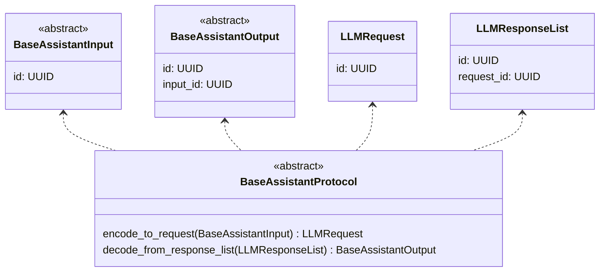

```mermaid
classDiagram

    class BaseAssistantProtocol {
        encode_to_request(BaseAssistantInput) LLMRequest
        decode_from_response_list(LLMResponseList) BaseAssistantOutput
    }

    class BaseAssistantInput {
        id: UUID
    }

    class BaseAssistantOutput {
        id: UUID
        input_id: UUID
    }

    class LLMRequest {
        id: UUID
    }

    class LLMResponseList {
        id: UUID
        request_id: UUID
    }

    <<abstract>> BaseAssistantProtocol
    <<abstract>> BaseAssistantInput
    <<abstract>> BaseAssistantOutput

    BaseAssistantInput <.. BaseAssistantProtocol
    BaseAssistantOutput <.. BaseAssistantProtocol
    LLMRequest <.. BaseAssistantProtocol
    LLMResponseList <.. BaseAssistantProtocol
```