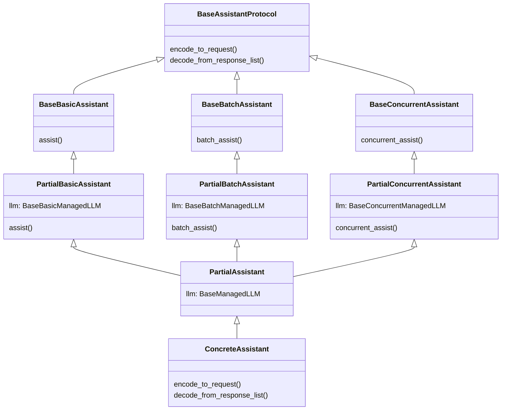

```mermaid
classDiagram
    class BaseAssistantProtocol {
        encode_to_request()
        decode_from_response_list()
    }

    %% basic 
    class BaseBasicAssistant {
        assist()
    }

    class PartialBasicAssistant {
        llm: BaseBasicManagedLLM

        assist()
    }

    BaseBasicAssistant <|-- PartialBasicAssistant
    BaseAssistantProtocol <|-- BaseBasicAssistant

    %% batch
    class BaseBatchAssistant {
        batch_assist()
    }

    class PartialBatchAssistant {
        llm: BaseBatchManagedLLM

        batch_assist()
    }

    BaseBatchAssistant <|-- PartialBatchAssistant
    BaseAssistantProtocol <|-- BaseBatchAssistant

    %% concurrent
    class BaseConcurrentAssistant {
        concurrent_assist()
    }

    class PartialConcurrentAssistant {
        llm: BaseConcurrentManagedLLM

        concurrent_assist()
    }

    BaseConcurrentAssistant <|-- PartialConcurrentAssistant
    BaseAssistantProtocol <|-- BaseConcurrentAssistant

    class PartialAssistant {
        llm: BaseManagedLLM
    }

    PartialBasicAssistant <|-- PartialAssistant
    PartialBatchAssistant <|-- PartialAssistant
    PartialConcurrentAssistant <|-- PartialAssistant


    class ConcreteAssistant {
        encode_to_request()
        decode_from_response_list()
    }

    PartialAssistant <|-- ConcreteAssistant
```