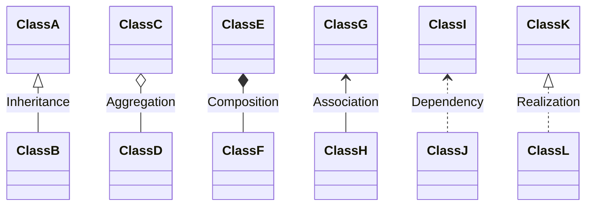

```mermaid
classDiagram
ClassA <|-- ClassB : Inheritance
ClassC o-- ClassD : Aggregation
ClassE *-- ClassF : Composition
ClassG <-- ClassH : Association
ClassI <.. ClassJ : Dependency
ClassK <|.. ClassL : Realization
```