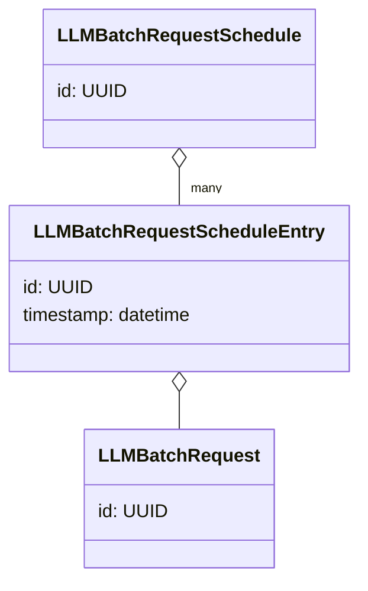

```mermaid
classDiagram

class LLMBatchRequestSchedule {
    id: UUID
}

class LLMBatchRequestScheduleEntry {
    id: UUID
    timestamp: datetime
}

class LLMBatchRequest {
    id: UUID
}

LLMBatchRequestSchedule o-- "many" LLMBatchRequestScheduleEntry
LLMBatchRequestScheduleEntry o-- LLMBatchRequest
```
