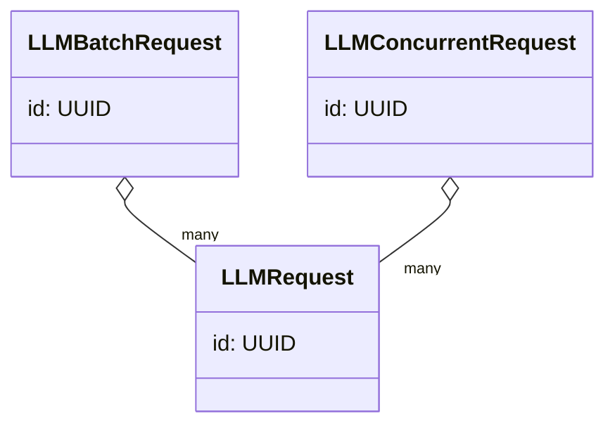

```mermaid
classDiagram

class LLMBatchRequest {
    id: UUID
}

class LLMRequest {
    id: UUID
}

class LLMConcurrentRequest {
    id: UUID
}

LLMBatchRequest o-- "many" LLMRequest
LLMConcurrentRequest o-- "many" LLMRequest
```
