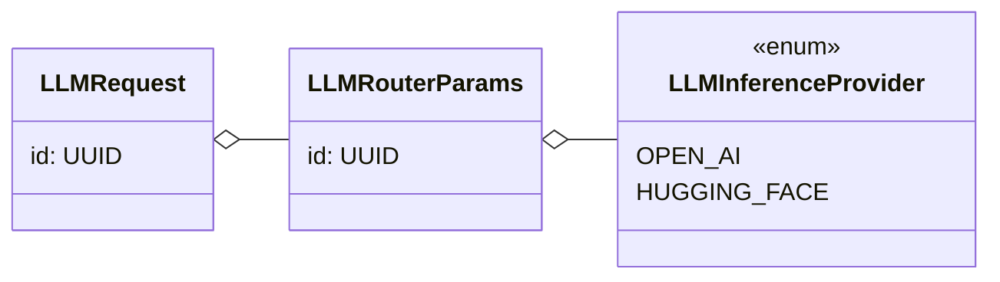

```mermaid
classDiagram
direction LR

class LLMRequest {
    id: UUID
}

class LLMRouterParams {
    id: UUID
}

class LLMInferenceProvider {
    <<enum>>
    OPEN_AI
    HUGGING_FACE
}

LLMRequest o-- LLMRouterParams
LLMRouterParams o-- LLMInferenceProvider
```
