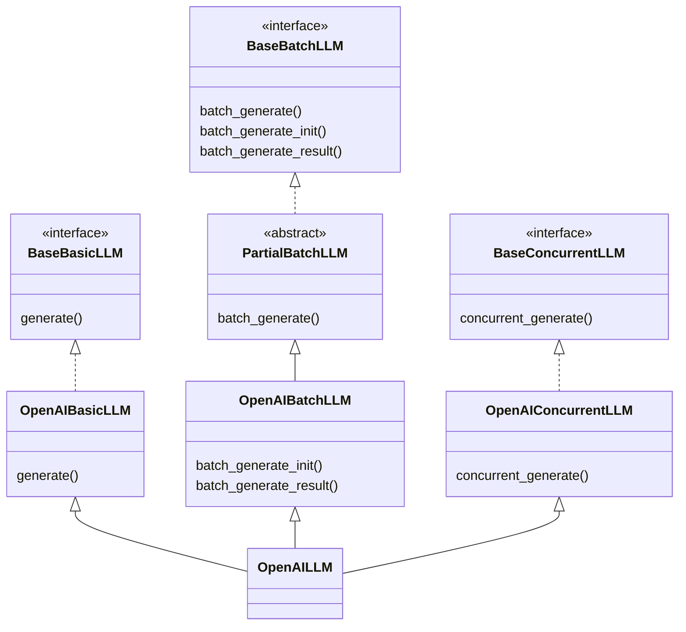

```mermaid
classDiagram
    class BaseBasicLLM {
        <<interface>>
        generate()
    }

    class BaseBatchLLM {
        <<interface>>
        batch_generate()
        batch_generate_init()
        batch_generate_result()
    }

    class BaseConcurrentLLM {
        <<interface>>
        concurrent_generate()
    }

    class PartialBatchLLM {
        <<abstract>>
        batch_generate()
    }

    class OpenAIBasicLLM {
        generate()
    }

    class OpenAIBatchLLM {
        batch_generate_init()
        batch_generate_result()
    }

    class OpenAIConcurrentLLM {
        concurrent_generate()
    }

    class OpenAILLM 

    BaseBasicLLM <|.. OpenAIBasicLLM
    BaseBatchLLM <|.. PartialBatchLLM
    PartialBatchLLM <|-- OpenAIBatchLLM
    BaseConcurrentLLM <|.. OpenAIConcurrentLLM

    OpenAIBasicLLM <|-- OpenAILLM
    OpenAIBatchLLM <|-- OpenAILLM
    OpenAIConcurrentLLM <|-- OpenAILLM
```