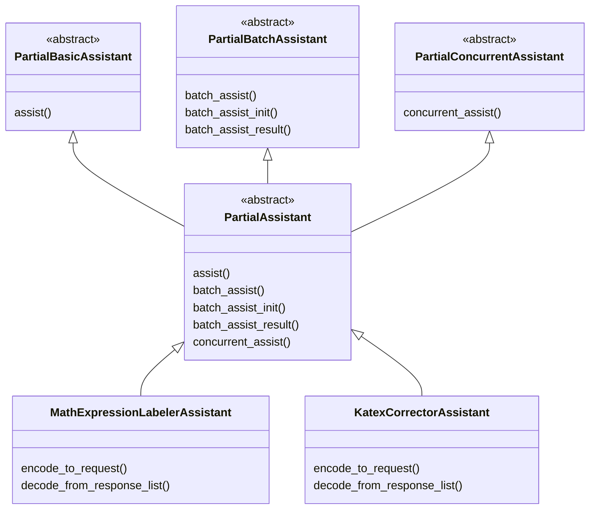

```mermaid
classDiagram

class PartialBasicAssistant {
    <<abstract>>
    assist()
}

class PartialBatchAssistant {
    <<abstract>>
    batch_assist()
    batch_assist_init()
    batch_assist_result()
}

class PartialConcurrentAssistant {
    <<abstract>>
    concurrent_assist()
}

class PartialAssistant {
    <<abstract>>
    assist()
    batch_assist()
    batch_assist_init()
    batch_assist_result()
    concurrent_assist()
}

class MathExpressionLabelerAssistant {
    encode_to_request()
    decode_from_response_list()
}

class KatexCorrectorAssistant {
    encode_to_request()
    decode_from_response_list()
}

PartialBasicAssistant <|-- PartialAssistant
PartialBatchAssistant <|-- PartialAssistant
PartialConcurrentAssistant <|-- PartialAssistant

PartialAssistant <|-- MathExpressionLabelerAssistant
PartialAssistant <|-- KatexCorrectorAssistant

```
