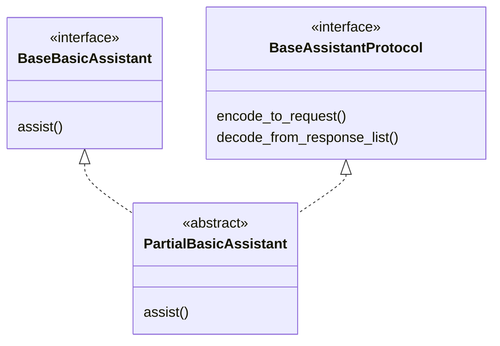

```mermaid
classDiagram

class BaseBasicAssistant {
    <<interface>>
    assist()
}

class BaseAssistantProtocol {
    <<interface>>
    encode_to_request()
    decode_from_response_list()
}

class PartialBasicAssistant {
    <<abstract>>
    assist()
}

BaseBasicAssistant <|.. PartialBasicAssistant
BaseAssistantProtocol <|.. PartialBasicAssistant
```