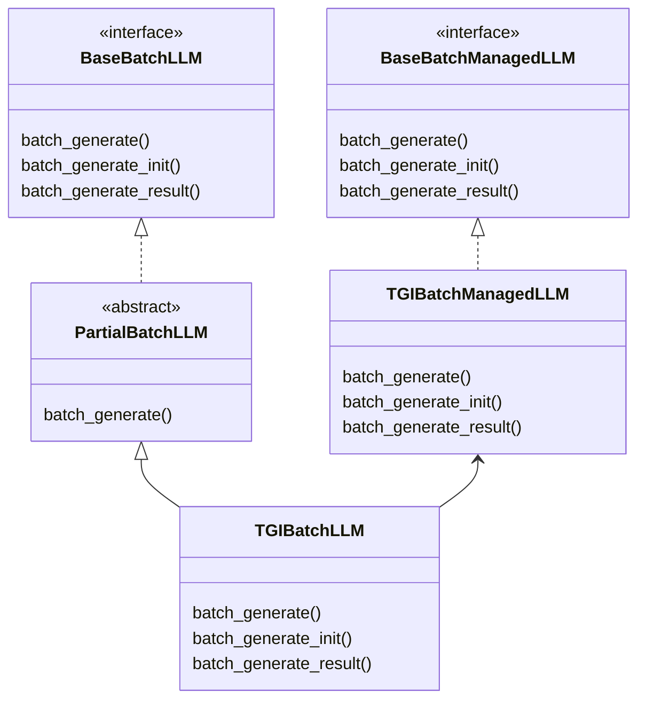

```mermaid
classDiagram
    class BaseBatchLLM {
        <<interface>>
        batch_generate()
        batch_generate_init()
        batch_generate_result()
    }

    class PartialBatchLLM {
        <<abstract>>
        batch_generate()
    }

    class TGIBatchLLM {
        batch_generate()
        batch_generate_init()
        batch_generate_result()
    }

    class BaseBatchManagedLLM {
        <<interface>>
        batch_generate()
        batch_generate_init()
        batch_generate_result()
    }

    class TGIBatchManagedLLM {
        batch_generate()
        batch_generate_init()
        batch_generate_result()
    }

    BaseBatchLLM <|.. PartialBatchLLM
    PartialBatchLLM <|-- TGIBatchLLM

    BaseBatchManagedLLM <|.. TGIBatchManagedLLM
    TGIBatchManagedLLM <-- TGIBatchLLM
```