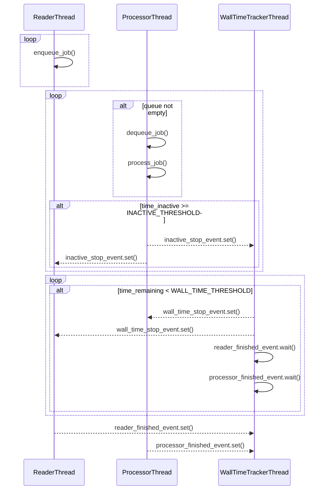

```mermaid
sequenceDiagram
    participant ReaderThread
    participant ProcessorThread
    participant WallTimeTrackerThread

    loop
        ReaderThread->>ReaderThread: enqueue_job()
    end

    loop
        alt queue not empty
            ProcessorThread->>ProcessorThread: dequeue_job()
            ProcessorThread->>ProcessorThread: process_job()
        end
        alt time_inactive >= INACTIVE_THRESHOLD
            ProcessorThread-->>WallTimeTrackerThread: inactive_stop_event.set()
            ProcessorThread-->>ReaderThread: inactive_stop_event.set()
        end
    end

    loop
        alt time_remaining < WALL_TIME_THRESHOLD
            WallTimeTrackerThread-->>ProcessorThread: wall_time_stop_event.set()
            WallTimeTrackerThread-->>ReaderThread: wall_time_stop_event.set()
            WallTimeTrackerThread->>WallTimeTrackerThread: reader_finished_event.wait()
            WallTimeTrackerThread->>WallTimeTrackerThread: processor_finished_event.wait()
        end
    end

    ReaderThread-->>WallTimeTrackerThread: reader_finished_event.set()
    ProcessorThread-->>WallTimeTrackerThread: processor_finished_event.set()
```
