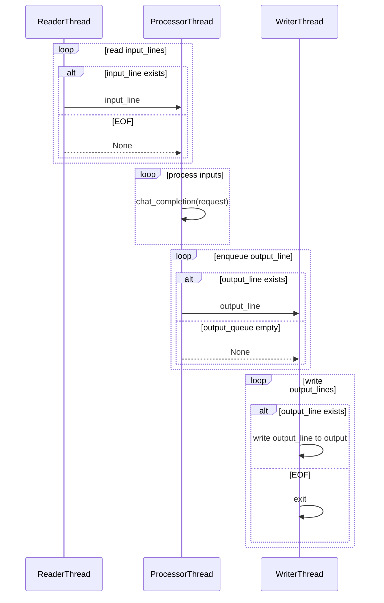

```mermaid
---
config:
  sequence:
    actorMargin: 80
---

sequenceDiagram
    participant ReaderThread
    participant ProcessorThread
    participant WriterThread

    loop read input_lines
        alt input_line exists
            ReaderThread->>ProcessorThread: input_line
        else EOF
            ReaderThread-->>ProcessorThread: None
        end
    end

    loop process inputs
        ProcessorThread->>ProcessorThread: chat_completion(request)
    end

    loop enqueue output_line
        alt output_line exists
            ProcessorThread->>WriterThread: output_line
        else output_queue empty
            ProcessorThread-->>WriterThread: None
        end
    end

    loop write output_lines
        alt output_line exists
            WriterThread->>WriterThread: write output_line to output
        else EOF
            WriterThread->>WriterThread: exit
        end
    end


```