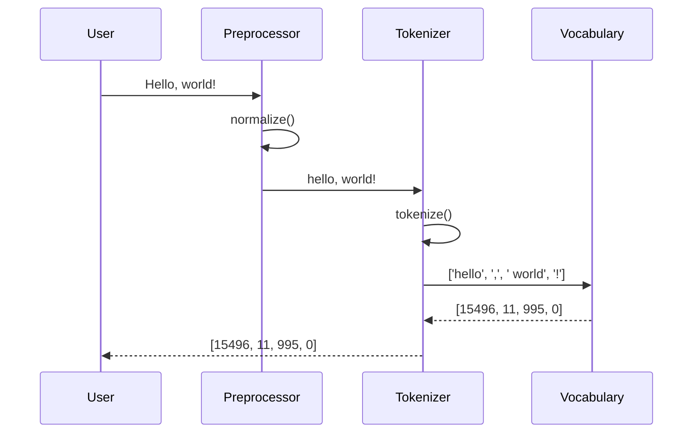

```mermaid
sequenceDiagram
    participant U as User
    participant P as Preprocessor
    participant T as Tokenizer
    participant V as Vocabulary
    U->>P: Hello, world!
    P->>P: normalize()
    P->>T: hello, world!
    T->>T: tokenize()
    T->>V: ['hello', ',', ' world', '!']
    V-->>T: [15496, 11, 995, 0]
    T-->>U: [15496, 11, 995, 0]
```