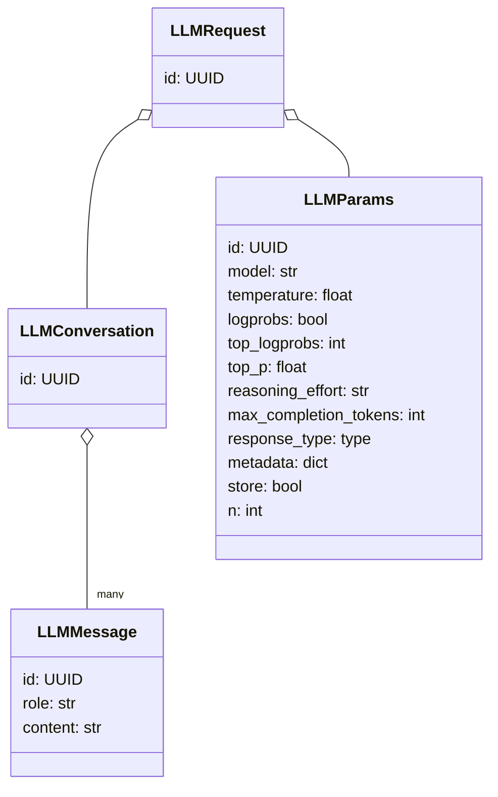

```mermaid
classDiagram

class LLMRequest {
    id: UUID
}

class LLMConversation {
    id: UUID
}

class LLMMessage {
    id: UUID
    role: str
    content: str
}

class LLMParams {
    id: UUID
    model: str
    temperature: float
    logprobs: bool
    top_logprobs: int
    top_p: float
    reasoning_effort: str
    max_completion_tokens: int
    response_type: type
    metadata: dict
    store: bool
    n: int
}

LLMRequest o-- LLMConversation
LLMRequest o-- LLMParams
LLMConversation o-- "many" LLMMessage
```
