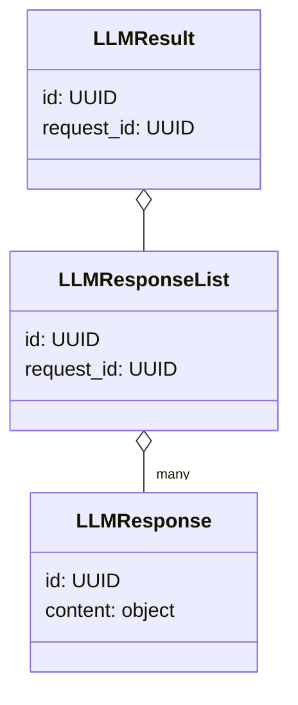

```mermaid
classDiagram

class LLMResponse {
    id: UUID
    content: object
}

class LLMResult {
    id: UUID
    request_id: UUID
}

class LLMResponseList {
    id: UUID
    request_id: UUID
}

LLMResult o-- LLMResponseList
LLMResponseList o-- "many" LLMResponse
```