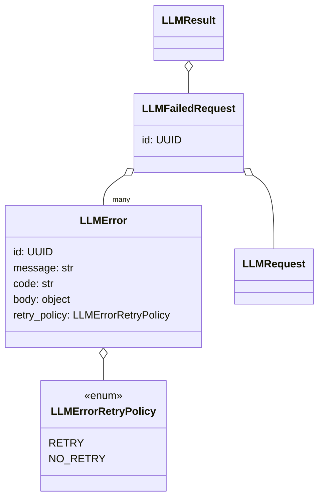

```mermaid
classDiagram

class LLMFailedRequest {
    id: UUID
}

class LLMError {
    id: UUID
    message: str
    code: str
    body: object
    retry_policy: LLMErrorRetryPolicy
}

class LLMErrorRetryPolicy {
    <<enum>>
    RETRY
    NO_RETRY
}

LLMResult o-- LLMFailedRequest
LLMFailedRequest o-- LLMRequest
LLMFailedRequest o-- "many" LLMError
LLMError o-- LLMErrorRetryPolicy
```