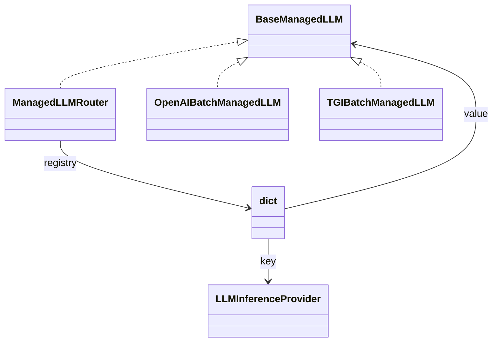

```mermaid
classDiagram

class BaseManagedLLM
class ManagedLLMRouter
class OpenAIBatchManagedLLM
class TGIBatchManagedLLM 
class dict 

BaseManagedLLM <|.. ManagedLLMRouter
BaseManagedLLM <|.. OpenAIBatchManagedLLM
BaseManagedLLM <|.. TGIBatchManagedLLM

dict --> LLMInferenceProvider: key
dict --> BaseManagedLLM: value
ManagedLLMRouter --> dict : registry
```
