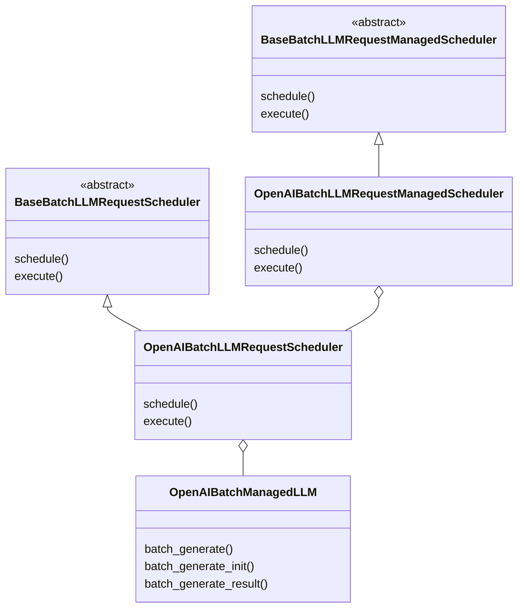

```mermaid
classDiagram

class BaseBatchLLMRequestScheduler {
    <<abstract>>
    schedule()
    execute()
}

class BaseBatchLLMRequestManagedScheduler {
    <<abstract>>
    schedule()
    execute()
}

class OpenAIBatchLLMRequestScheduler {
    schedule()
    execute()
}

class OpenAIBatchLLMRequestManagedScheduler {
    schedule()
    execute()
}

class OpenAIBatchManagedLLM {
    batch_generate()
    batch_generate_init()
    batch_generate_result()
}

BaseBatchLLMRequestScheduler <|-- OpenAIBatchLLMRequestScheduler
BaseBatchLLMRequestManagedScheduler <|-- OpenAIBatchLLMRequestManagedScheduler

OpenAIBatchLLMRequestScheduler o-- OpenAIBatchManagedLLM
OpenAIBatchLLMRequestManagedScheduler o-- OpenAIBatchLLMRequestScheduler
```
