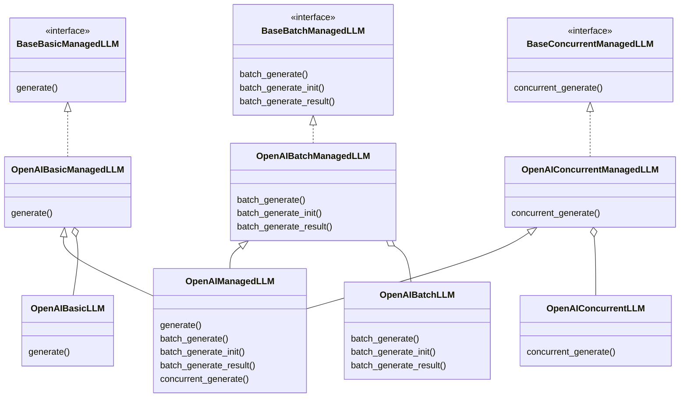

```mermaid
classDiagram
    class BaseBasicManagedLLM {
        <<interface>>
        generate()
    }

    class BaseBatchManagedLLM {
        <<interface>>
        batch_generate()
        batch_generate_init()
        batch_generate_result()
    }

    class BaseConcurrentManagedLLM {
        <<interface>>
        concurrent_generate()
    }

    class OpenAIBasicManagedLLM {
        generate()
    }

    class OpenAIBatchManagedLLM {
        batch_generate()
        batch_generate_init()
        batch_generate_result()
    }

    class OpenAIConcurrentManagedLLM {
        concurrent_generate()
    }

    class OpenAIManagedLLM {
        generate()
        batch_generate()
        batch_generate_init()
        batch_generate_result()
        concurrent_generate()
    }

    class OpenAIBasicLLM {
        generate()
    }

    class OpenAIBatchLLM {
        batch_generate()
        batch_generate_init()
        batch_generate_result()
    }

    class OpenAIConcurrentLLM {
        concurrent_generate()
    }

    BaseBasicManagedLLM <|.. OpenAIBasicManagedLLM
    BaseBatchManagedLLM <|.. OpenAIBatchManagedLLM
    BaseConcurrentManagedLLM <|.. OpenAIConcurrentManagedLLM

    OpenAIBasicManagedLLM <|-- OpenAIManagedLLM
    OpenAIBatchManagedLLM <|-- OpenAIManagedLLM
    OpenAIConcurrentManagedLLM <|-- OpenAIManagedLLM

    OpenAIBasicManagedLLM o-- OpenAIBasicLLM
    OpenAIBatchManagedLLM o-- OpenAIBatchLLM
    OpenAIConcurrentManagedLLM o-- OpenAIConcurrentLLM

```