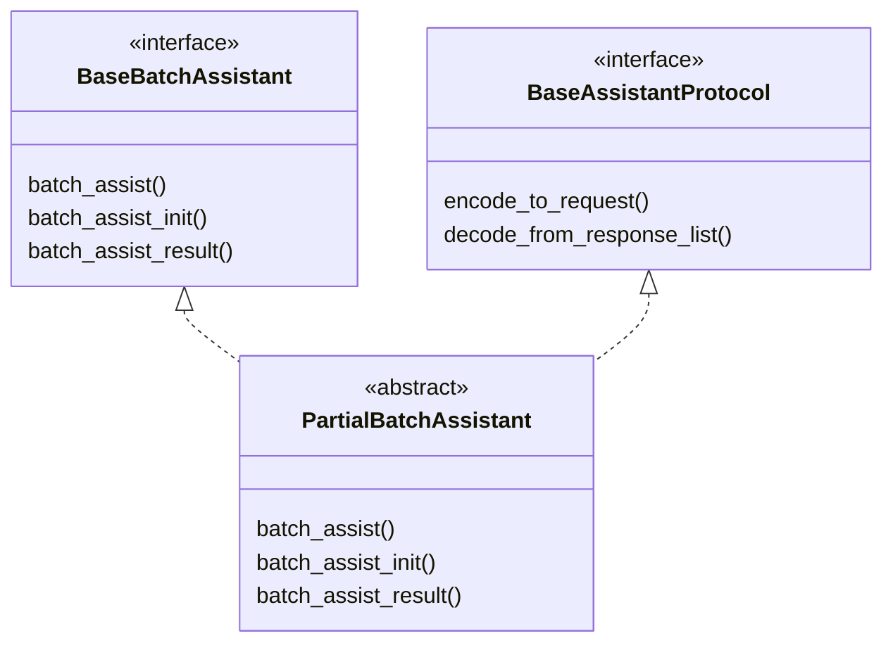

```mermaid
classDiagram

class BaseBatchAssistant {
    <<interface>>
    batch_assist()
    batch_assist_init()
    batch_assist_result()
}

class BaseAssistantProtocol {
    <<interface>>
    encode_to_request()
    decode_from_response_list()
}

class PartialBatchAssistant {
    <<abstract>>
    batch_assist()
    batch_assist_init()
    batch_assist_result()
}

BaseBatchAssistant <|.. PartialBatchAssistant
BaseAssistantProtocol <|.. PartialBatchAssistant
```