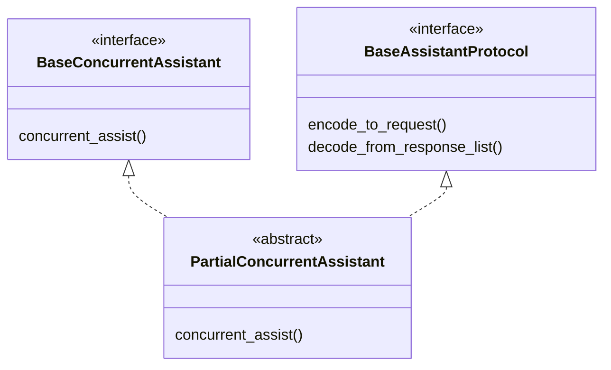

```mermaid
classDiagram

class BaseConcurrentAssistant {
    <<interface>>
    concurrent_assist()
}

class BaseAssistantProtocol {
    <<interface>>
    encode_to_request()
    decode_from_response_list()
}

class PartialConcurrentAssistant {
    <<abstract>>
    concurrent_assist()
}

BaseConcurrentAssistant <|.. PartialConcurrentAssistant
BaseAssistantProtocol <|.. PartialConcurrentAssistant

```