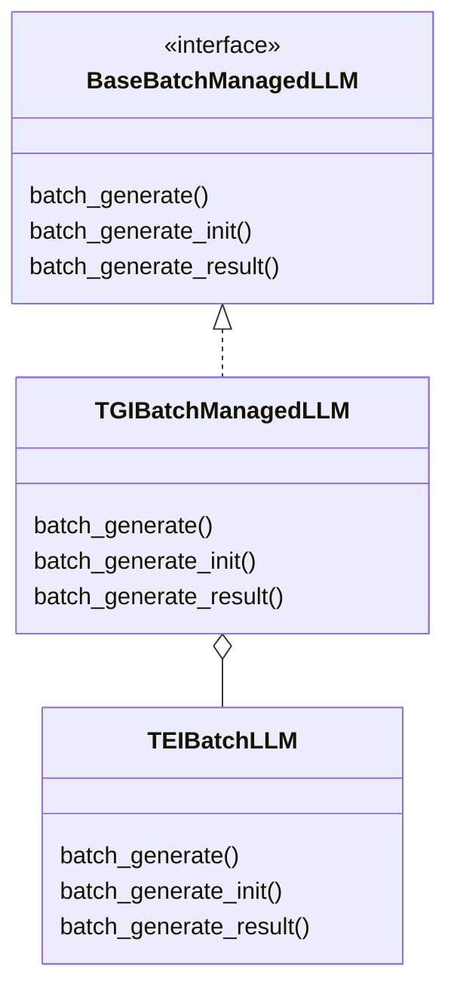

```mermaid
classDiagram
    class BaseBatchManagedLLM {
        <<interface>>
        batch_generate()
        batch_generate_init()
        batch_generate_result()
    }

    class TGIBatchManagedLLM {
        batch_generate()
        batch_generate_init()
        batch_generate_result()
    }

    class TEIBatchLLM {
        batch_generate()
        batch_generate_init()
        batch_generate_result()
    }

    BaseBatchManagedLLM <|.. TGIBatchManagedLLM
    TGIBatchManagedLLM o-- TEIBatchLLM
```